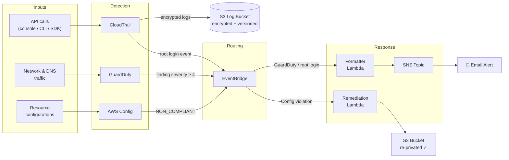
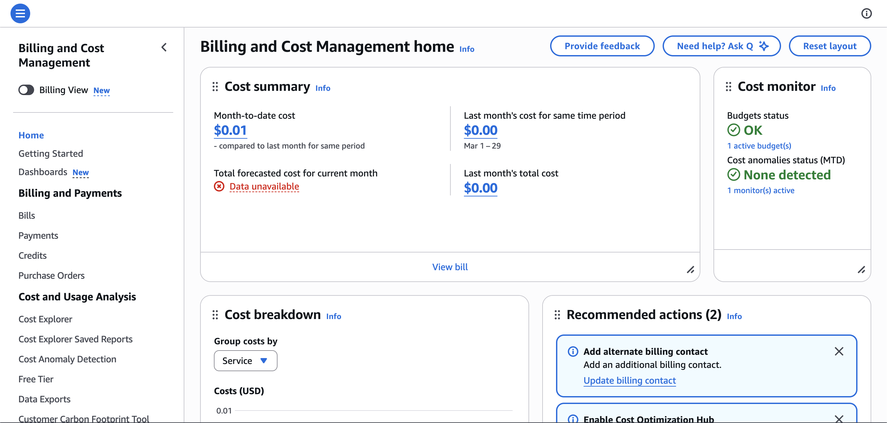
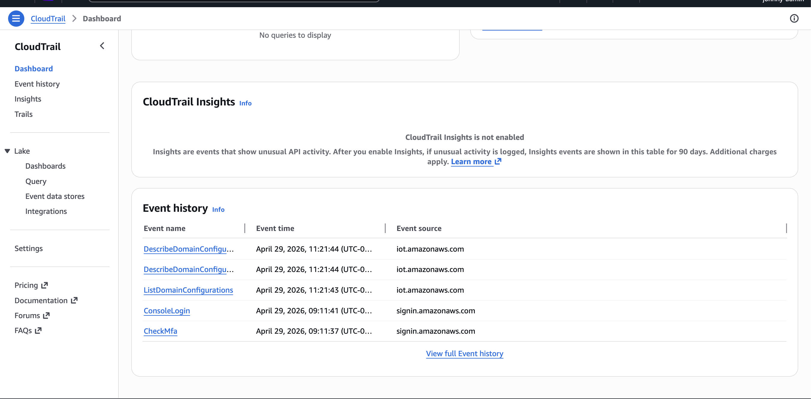
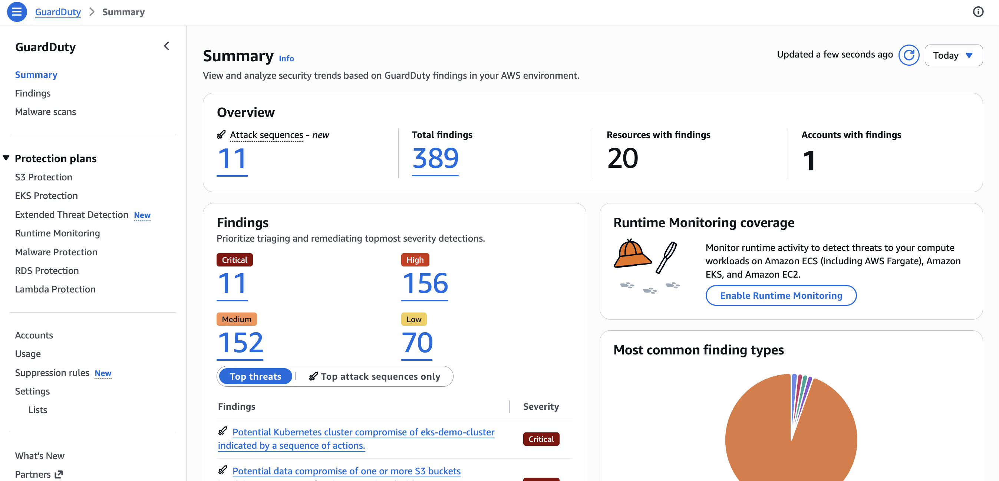
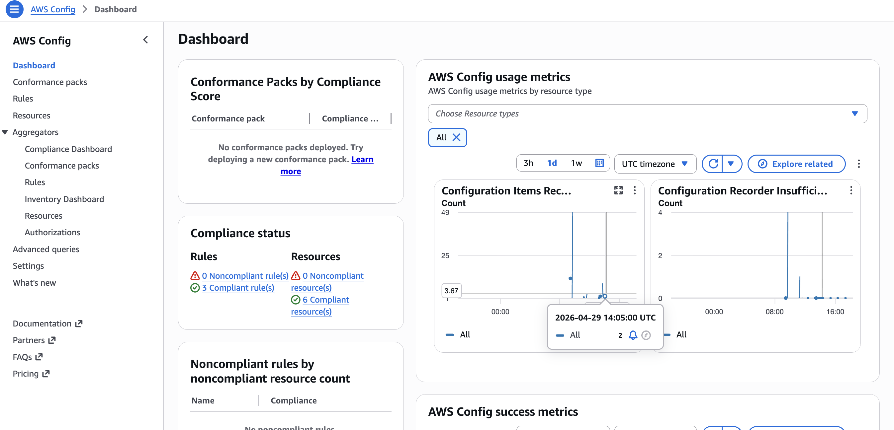
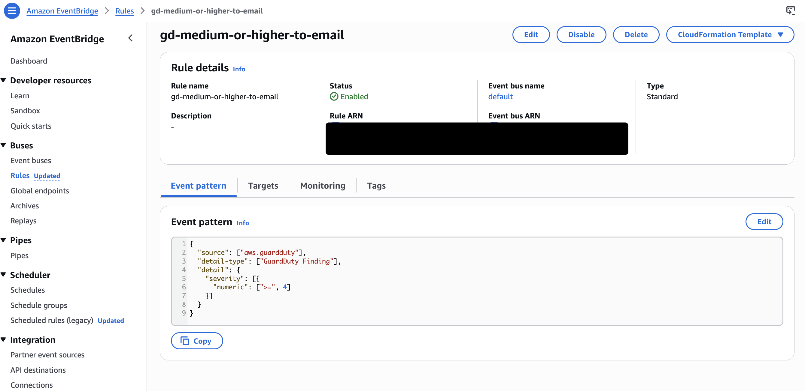
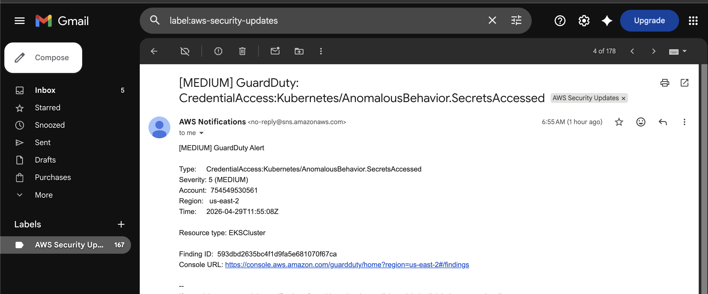
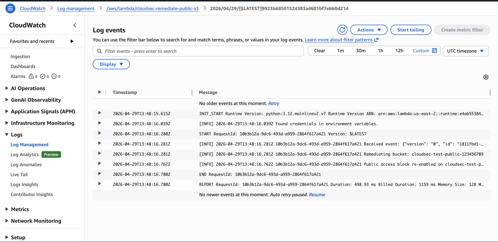
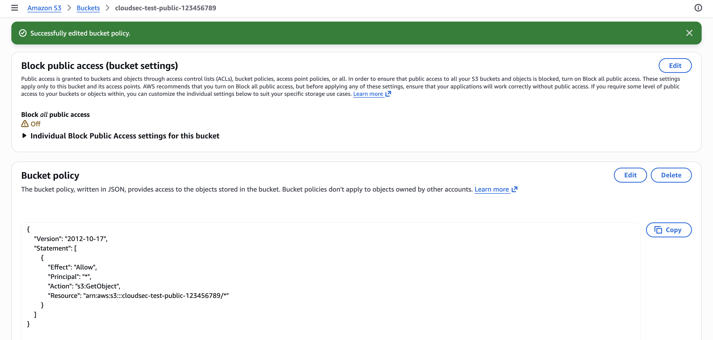
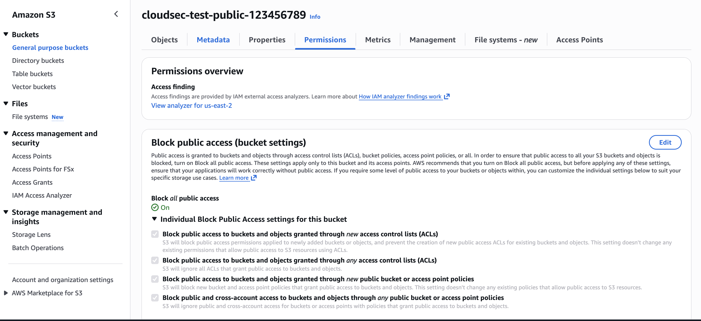

# AWS Cloud Security Posture Lab

> A beginner-friendly AWS Free Tier project that builds a working **detection + auto-remediation pipeline** — the same building blocks a real cloud security team uses to monitor their environment.

**Author:** Johnny Nguyen — Iowa State MIS / Cybersecurity Minor
**Status:** In progress
**Cost:** $0 (entirely AWS Free Tier with cost guardrails)

---

## What this lab does

In one AWS account, you stand up a small Security Operations Center that:

1. **Logs every action** taken in the account (CloudTrail → S3)
2. **Detects threats and misconfigurations** automatically (GuardDuty + AWS Config)
3. **Alerts you over email** when something interesting happens (EventBridge → SNS)
4. **Auto-remediates** at least one common misconfiguration — a public S3 bucket — using a serverless function (EventBridge → Lambda)
5. **Is reproducible as code** via a Terraform module (level-up appendix)

The lab is intentionally small enough to finish in a weekend and small enough to stay inside the Free Tier, but it touches every layer a cloud security engineer is expected to understand.

---

## Architecture



---

## Tech stack

| Layer | Service | Role |
|-------|---------|------|
| Audit | **AWS CloudTrail** | Records every API call as a forensic log |
| Threat detection | **AWS GuardDuty** | Managed ML threat detection |
| Posture/compliance | **AWS Config** | Tracks resource configs and flags non-compliant ones |
| Storage | **Amazon S3** | Encrypted log archive |
| Identity | **AWS IAM** | Least-privilege users, roles, and policies |
| Routing | **Amazon EventBridge** | Pattern-matches events and routes to targets |
| Notification | **Amazon SNS** | Email pub/sub for security alerts |
| Compute | **AWS Lambda (Python)** | Serverless auto-remediation function |
| Observability | **Amazon CloudWatch** | Alarms and metric dashboards |
| IaC | **Terraform** *(appendix)* | Codifies the whole stack |

---

## Skills demonstrated

- **Cloud security fundamentals** — least privilege, defense in depth, shared responsibility
- **Logging & monitoring architecture** — CloudTrail / Config / GuardDuty as a stack
- **Detection engineering** — writing EventBridge patterns to match suspicious events
- **Incident response automation** — Lambda-based auto-remediation
- **AWS IAM** — purpose-built service roles with scoped policies
- **Infrastructure as Code** — Terraform module for a security baseline
- **Cost guardrails** — Budgets, billing alarms, Free Tier hygiene

---

## Repository layout

```
cloud-security-lab/
├── README.md           ← this file (project overview, GitHub front page)
├── HOWTO.md            ← in-depth student build guide (start here)
├── ARCHITECTURE.md     ← diagrams + design decisions
├── terraform/          ← IaC for the security baseline (appendix)
│   └── main.tf
└── lambda/             ← auto-remediation source
    └── remediate_public_s3.py
```

> **Start at [HOWTO.md](./HOWTO.md)** if you want to build it. This README is a top-of-repo overview for visitors.

---

## Free Tier hygiene

This entire lab is designed to stay in the AWS Free Tier:

- **CloudTrail** — management events are free for the first trail in every account
- **GuardDuty** — 30-day free trial for new accounts
- **AWS Config** — 1,000 configuration item recordings free per month for new accounts (this lab uses far less)
- **S3** — 5 GB of standard storage, 20K GET / 2K PUT requests per month free for 12 months
- **Lambda** — 1M invocations + 400K GB-seconds per month always-free
- **SNS** — 1M publishes / 1K email deliveries per month always-free
- **CloudWatch** — 10 custom metrics + 10 alarms free

**Cost guardrails (configured in Phase 1):**
- A **Zero-Spend AWS Budget** that emails you the moment a single cent is forecasted
- A **CloudWatch billing alarm** as a backup
- An **end-of-lab cleanup checklist** in HOWTO.md so nothing is left running

---

## Screenshots

| | |
|---|---|
|  |  |
| **$0 budget + billing guardrails** | **CloudTrail event history** |
|  |  |
| **GuardDuty — 389 findings detected** | **AWS Config — all rules compliant** |
|  |  |
| **EventBridge rule with JSON filter** | **Formatted alert email in inbox** |
|  | |
| **CloudWatch logs — Lambda remediated the bucket in 498ms** | |

**Auto-remediation before → after:**

| Before (bucket made public) | After (Lambda re-privated it) |
|---|---|
|  |  |

---

## What I learned

I built this lab alongside the AWS Cloud Practitioner Essentials course to really get a grasp of the AWS toolkit and how everything connects. The course gives you the vocabulary but this lab made it real.

- **The services work together way more seamlessly than I expected.** CloudTrail feeds GuardDuty, GuardDuty publishes to EventBridge, EventBridge triggers Lambda, and once it's running it honestly feels like one system rather than eight separate ones. Watching a public S3 bucket get automatically re-privated in under 500ms was the moment the whole architecture clicked for me.
- **IAM is harder than it looks.** Wiring up the Lambda execution role taught me the difference between a trust policy (who can assume the role) and a permissions policy (what the role can do). Getting that wrong breaks everything downstream and the error messages are not always helpful about where the problem actually is.
- **EventBridge patterns are really customizable.** Filtering GuardDuty findings by severity using a JSON numeric condition, with no application code at all, was a good lesson in how much you can do just by configuring AWS services the right way.
- **Detection without a response is just a louder inbox.** The formatter Lambda was the part that made alerts actually useful, a readable subject line, severity label, and a direct console URL. Raw JSON hitting your email at 3am does not help anyone.
- **Cloud security is really an architecture problem more than a coding one.** The controls here are not complex code, they are the right services connected in the right order. That is a pattern I plan to keep building on as I get deeper into this space.

---

## Roadmap

- [x] Phase 1–8: Build the lab via the AWS Console (HOWTO.md)
- [ ] Phase 9: Re-deploy the same architecture using Terraform
- [ ] Phase 10: Extend remediation — auto-disable IAM access keys older than 90 days
- [ ] Phase 11: Send findings to a free-tier Datadog or Grafana Cloud account for visualization
- [ ] Phase 12: Deploy across a multi-account AWS Organization (separate Security account)

---

## License

MIT — feel free to fork and adapt for your own learning.
